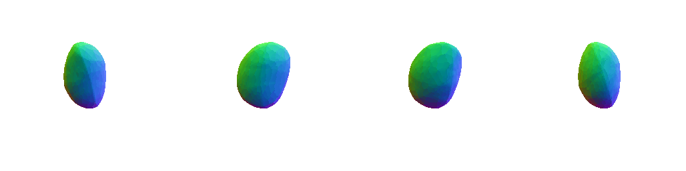

# NASA.PyTorch

This is a PyTorch implementation of [NASA: Neural Articulated Shape Approximation](https://arxiv.org/abs/1912.03207)



## Requirements
- [Human Pose Prior[modified version]](https://github.com/YuliangXiu/human_body_prior)
- [AMASS](https://github.com/nghorbani/amass)
- [PyTorch-Lightning](https://pytorch-lightning.readthedocs.io/)
- [mcubes_pytorch](https://github.com/tatsy/mcubes_pytorch)

## Dataset Processing
- [AMASS](https://github.com/nghorbani/amass)
- [CLOTH3D](https://github.com/YuliangXiu/CLOTH3D/Demo/dataset.ipynb)

## Training

```
CUDA_VISIBLE_DEVICES=1 python train_net_light.py  -cfg ../configs/pl_w_sk.yaml   -- \ 
```

## Related works
- [AMASS: Archive of Motion Capture as Surface Shapes](https://amass.is.tue.mpg.de/)
- [Expressive Body Capture: 3D Hands, Face, and Body from a Single Image](https://smpl-x.is.tue.mpg.de/)
- [Implicit Functions in Feature Space for 3D Shape Reconstruction and Completion](https://virtualhumans.mpi-inf.mpg.de/publications.html)

## Contact
The code in this repository is developed by [Yuliang Xiu](http://xiuyuliang.cn/)


